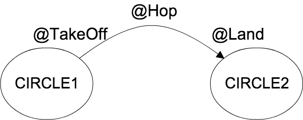

# Ken-Ken-Pa

[](http://travis-ci.org/shiraji/kenkenpa)  [](https://github.com/shiraji/kenkenpa/blob/master/LICENSE) [](https://gitter.im/shiraji/kenkenpa?utm_source=badge&utm_medium=badge&utm_campaign=pr-badge&utm_content=badge)

* [](https://bintray.com/shiraji/maven/kenkenpa/_latestVersion) : kenkenpa
* [ ](https://bintray.com/shiraji/maven/kenkenpa-compiler/_latestVersion) : kenkenpa-compiler

Yet, another light weight Java FSM library. This library follows the idea from [Google AutoValue](https://github.com/google/auto/tree/master/value). It generates a subclass that handles states.

# How to install?

Use gradle.

```gradle
buildscript {
    repositories {
      jcenter()
      mavenCentral()
    }
    dependencies {
        classpath 'com.neenbedankt.gradle.plugins:android-apt:1.7'
    }
}

apply plugin: 'com.neenbedankt.android-apt'

android {
    packagingOptions {
        exclude 'META-INF/services/javax.annotation.processing.Processor'
    }
}

dependencies {
    provided 'com.github.shiraji:kenkenpa:1.0.3'
    apt 'com.github.shiraji:kenkenpa-compiler:1.0.3'
}
```

`packagingOptions` block is for developers who use other apt libraries.

If you cannot use gradle, then download jar from Download button on top of the documentation.

# How to install develop version?

Please refer [jitpack.io](https://jitpack.io/#shiraji/kenkenpa)

If you do not find right version, please leave a message on gitter.

# What is Ken-Ken-Pa?

Ken-Ken-Pa is a Japanese style of Hop Scotch. The difference between Hop Scotch and Ken-Ken-Pa is whether they use squares or circles.

# What does this library do?

When you call a method that has `@Hop(from = "CIRCLE1", to = "CIRCLE2")` annotation, this is an image of execution steps of Ken-Ken-Pa.



1. Call `@TakeOff("CIRCLE1")` method if exist
1. Call the method that has `@Hop(from = "CIRCLE1", to = "CIRCLE2")`
1. Call `@Land("CIRCLE2")` method if exist
1. Change the current state to "CIRCLE2"

# How to use?

There are a few steps to use this library.

First, add `@KenKenPa` annotation to the abstract class. This abstract class will be a state machine class. `@KenKenPa` annotation needs to have a default state. Currently, states are represented by only String values.

```java
@KenKenPa("CIRCLE1")
public abstract class SimpleFSM {
}
```

Secondly, create new instance method. The method must return an instance of subclass. The subclass name format is KenKenPa_XXX where XXX is the abstract class name.

```java
@KenKenPa("CIRCLE1")
public abstract class SimpleFSM {
    public static SimpleFSM create() {
        return new KenKenPa_SimpleFSM();
    }
}
```

Thirdly, add `@Hop` to define state changes.

```java
@KenKenPa("CIRCLE1")
public abstract class SimpleFSM {
    public static SimpleFSM create() {
        return new KenKenPa_SimpleFSM();
    }

    @Hop(from = "CIRCLE1", to = "CIRCLE2")
    public void fire() {
      System.out.println("fire!");
    }
}

```

Now, you are set. You can use this class

```java
SimpleFSM simpleFSM = SimpleFSM.create();
simpleFSM.fire(); // => fire! and change current state to CIRCLE2
```

## How to create multiple `@Hop`s?

Sadly, there is limitation on Java (less than Java8). You cannot set same annotation on the same method. Instead of using `@Hop`, use `@Hops` which take multiple `@Hop` as parameters.

```java
@KenKenPa("CIRCLE1")
public abstract class SimpleFSM {
    public static SimpleFSM create() {
        return new KenKenPa_SimpleFSM();
    }

    @Hops({@Hop(from = "CIRCLE1", to = "CIRCLE2"),
            @Hop(from = "CIRCLE2", to = "CIRCLE3")})
    public void fire() {
      System.out.println("fire!");
    }
}
```

```java
SimpleFSM simpleFSM = SimpleFSM.create();
simpleFSM.fire(); // => fire!
simpleFSM.fire(); // => fire! and change current state to CIRCLE3
```

## How to get current state?

To get current state, you can add GetCurrentState interface to the abstract class.

```java
@KenKenPa("CIRCLE1")
public abstract class SimpleFSM implements GetCurrentState
```

this interface offers `String getCurrentState()` method.

```java
SimpleFSM simpleFSM = SimpleFSM.create();
simpleFSM.getCurrentState() // => CIRCLE1
```

## What is `@TakeOff`?

When children hop to another circle, they "take off" the current circle. `@TakeOff` is an annotation that represents "Run this method when the current state changed from this state." This annocation is useful when the state require clean up. Annotated method must not have parameters. A state of `@TakeOff` should be at least one state that defines at `@Hop`'s `from` parameter. Also, `void` should be return type. (You can still set return type but you have no way to get the return value)

```java
@KenKenPa("CIRCLE1")
public abstract class MainFSM implements GetCurrentState {
    public static MainFSM newInstance() {
        return new KenKenPa_MainFSM();
    }

    @Hop(from = "CIRCLE1", to = "CIRCLE2")
    public void circle1ToCircle2() {
    }

    @Hop(from = "CIRCLE1", to = "CIRCLE3")
    public void circle1ToCircle3() {
    }

    @Hop(from = "CIRCLE2", to = "CIRCLE1")
    public void circle2ToCircle1() {
    }

    @TakeOff("CIRCLE1")
    void endCircle1() {
      System.out.println("Exit from CIRCLE1");
    }
}
```

```java
SimpleFSM simpleFSM = SimpleFSM.create();
simpleFSM.circle1ToCircle2(); // => display 'Exit from CIRCLE1'
simpleFSM.circle2ToCircle1(); // => change current state to CIRCLE1
simpleFSM.circle1ToCircle3(); // => display 'Exit from CIRCLE1' and change current state to CIRCLE3
```

Add description for string parameter.

## What is `@Land`?

When children hop to another circle, they 'land' the next circle. `@Land` is an annotation that represents "Run this method when the current state became this state." This annotation is useful when the state have the same initialization steps. Annotated method must not have parameters. A state of `@Land` should be the default state or at least one state that defines at `@Hop`'s `to` parameter. Also, `void` should be return type. (You can still set return type but you have no way to get the return value)

```java
@KenKenPa("CIRCLE1")
public abstract class MainFSM implements GetCurrentState {
    public static MainFSM newInstance() {
        return new KenKenPa_MainFSM();
    }

    @Hop(from = "CIRCLE1", to = "CIRCLE2")
    public void circle1ToCircle2() {
    }

    @Hop(from = "CIRCLE1", to = "CIRCLE3")
    public void circle1ToCircle3() {
    }

    @Hop(from = "CIRCLE2", to = "CIRCLE1")
    public void circle2ToCircle1() {
    }

    @Land("CIRCLE2")
    void startCircle2() {
      System.out.println("Now CIRCLE2");
    }
}
```

```java
SimpleFSM simpleFSM = SimpleFSM.create();
simpleFSM.circle1ToCircle2(); // => display 'Now CIRCLE2'
simpleFSM.circle2ToCircle1(); // => change current state to CIRCLE1
```

Add description for string parameter.

## How actually works?

If the developer creates following KenKenPa annotation class

```java
@KenKenPa("CIRCLE1")
public abstract class TestSM implements GetCurrentState {

    private String mText;

    TestSM(String text) {
        mText = text;
    }

    public static TestSM create(String text) {
        return new KenKenPa_TestSM(text);
    }

    @Hops({@Hop(from = "CIRCLE1", to = "CIRCLE2"), @Hop(from = "CIRCLE2", to = "CIRCLE1")})
    public void fire() {
        System.out.println("Fire!");
    }

    @Hop(from = "CIRCLE1", to = "CIRCLE2")
    public int fire2() {
        return 1;
    }

    @Land("CIRCLE1")
    public void land() {
        System.out.println("land");
    }

    @TakeOff("CIRCLE2")
    public void takeOff() {
        System.out.println("takeoff");
    }
}
```

KenKenPa_TestSM is generated at compile time.

```java
public final class KenKenPa_TestSM extends TestSM {
  private String $$mCurrentState$$;

  KenKenPa_TestSM(String text) {
    super(text);
    this.$$mCurrentState$$ = "CIRCLE1";
    land();
  }

  @Override
  @Hops({
      @Hop(from = "CIRCLE1", to = "CIRCLE2"),
      @Hop(from = "CIRCLE2", to = "CIRCLE1")
  })
  public final void fire() {
    String newState = takeOff$$fire();
    super.fire();
    land$$fire(newState);
    $$mCurrentState$$ = newState;
  }

  @Override
  @Hop(
      from = "CIRCLE1",
      to = "CIRCLE2"
  )
  public final int fire2() {
    String newState = takeOff$$fire2();
    int returnValue = super.fire2();
    land$$fire2($$mCurrentState$$);
    $$mCurrentState$$ = newState;
    return returnValue;
  }

  @Override
  public final String getCurrentState() {
    return $$mCurrentState$$;
  }

  private final String takeOff$$fire2() {
    switch($$mCurrentState$$) {
      case "CIRCLE1":
      return "CIRCLE2";
    }
    // No definition! Return the default state
    return "CIRCLE1";
  }

  private final void land$$fire2(String newState) {
    switch(newState) {
      case "CIRCLE1":
      land();
      break;
    }
  }

  private final String takeOff$$fire() {
    switch($$mCurrentState$$) {
      case "CIRCLE1":
      return "CIRCLE2";
      case "CIRCLE2":
      takeOff();
      return "CIRCLE1";
    }
    // No definition! Return the default state
    return "CIRCLE1";
  }

  private final void land$$fire(String newState) {
    switch(newState) {
      case "CIRCLE1":
      land();
      break;
      case "CIRCLE2":
      break;
    }
  }
}

```

## License

```
Copyright 2015 Yoshinori Isogai

Licensed under the Apache License, Version 2.0 (the "License");
you may not use this file except in compliance with the License.
You may obtain a copy of the License at

   http://www.apache.org/licenses/LICENSE-2.0

Unless required by applicable law or agreed to in writing, software
distributed under the License is distributed on an "AS IS" BASIS,
WITHOUT WARRANTIES OR CONDITIONS OF ANY KIND, either express or implied.
See the License for the specific language governing permissions and
limitations under the License.
```
